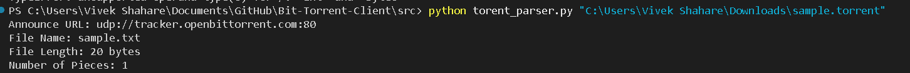

# BitTorrent Client

A lightweight BitTorrent client built from scratch in Python.  
This project focuses on understanding the **BitTorrent protocol**, peer-to-peer networking, and file distribution.  
The client will handle `.torrent` file parsing, peer communication, piece downloading, and file reconstruction.

---

## 🚀 Tech Stack
- **Python** – Core programming language  
- **Sockets** – For peer-to-peer communication  
- **Asyncio** – For handling concurrent connections with peers  
- **bencodepy** – For parsing and encoding `.torrent` metadata  

---

## 📅 Roadmap

### Week 1
- Set up project structure  
- Learn the BitTorrent protocol basics  
- Implement `.torrent` file parser (using `bencodepy`)  

### Week 2
- Establish connections with peers (handshake using sockets)  
- Implement peer wire protocol basics  
- Manage multiple peers with `asyncio`  

### Week 3
- Download file pieces from peers  
- Handle piece verification with SHA-1 hashing  
- Reconstruct the original file  

### Week 4
- Optimize piece selection strategy (rarest-first, sequential)  
- Add upload capability (seeding)  
- Documentation & cleanup  

---


## 📖 `.torrent` File Keys Explained

A `.torrent` file is a bencoded dictionary that contains metadata about the files to be shared.  
Here’s what the main keys mean:

- **announce** → URL of the tracker server that coordinates peers.  
- **announce-list** *(optional)* → List of backup tracker URLs.  
- **info** → Dictionary containing file information:  
  - **piece length** → Size (in bytes) of each piece (e.g., 16384).  
  - **pieces** → Concatenated SHA-1 hashes of all pieces (each 20 bytes).  
  - **name** → Suggested name for the file or directory.  
  - **length** → File size in bytes (for single-file torrents).  
  - **files** → List of dictionaries for multi-file torrents:  
    - **length** → Size of the file.  
    - **path** → Path segments for the file location.  
- **creation date** *(optional)* → Unix timestamp when the torrent was created.  
- **comment** *(optional)* → User or software-provided note.  
- **created by** *(optional)* → Software used to create the torrent.  

---

## 🛠 Sample Output from Parser

### Single-file torrent:
```python
{
  'announce': 'http://tracker.opentrackr.org:1337/announce',
  'creation date': 1664526000,
  'created by': 'qBittorrent v4.3.9',
  'info': {
    'piece length': 16384,
    'pieces': '<binary hash data>',
    'name': 'example.txt',
    'length': 524288
  }
}

